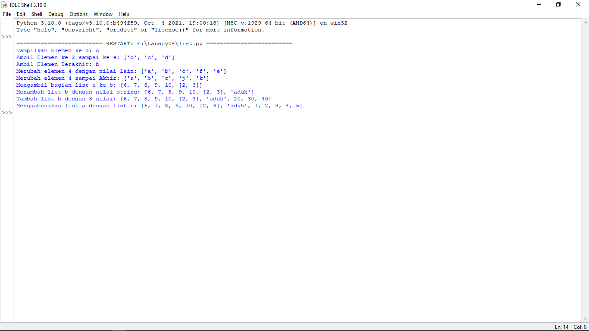

# labspy04
## Latihan 1

     list=["a", "b", "c", "d", "e"]

    print("Tampilkan Elemen ke 3: ",list[2])
    print("Ambil Elemen ke 2 sampai ke 4:",list[1:4])
    print("Ambil Elemen Terakhir:",list[-4])

    #Merubah Elemen ke 4 dengan nilai lain
    list[3] = "f"
    print("Merubah elemen 4 dengan nilai lain:",list)

    #Merubah Elemen ke 4 sampai terakhir
    list[3:] = "j","k"
    print("Merubah elemen 4 sampai Akhir:",list)

    #Tambah Elemen List
    a =[1,2,3,4,5]
    b =[6,7,8,9,10]
    #Ambil 2 bagian dari list a ke b
    b.append(a[1:3])
    print("Mengambil bagian dari list a ke b:",b)
    #Menambah list b dengan nilai string
    b.append("aduh")
    print("Menambah list b dengan nilai string:",b)
    #Menambah list b dengan 3 nilai
    print("Tambah list b dengan 3 nilai", b+[20,30,40])
    #Menggabungkan list b dengan list a
    c=b+a
    print("Menggabungkan list a dengan list b:", c)

### Contoh Input

### Hasil Output

## Tugas Praktikum
    i = 0
    nama =[]
    nim =[]
    tugas =[]
    uts =[]
    uas =[]
    nilaiakhir =[]

    while True:
        nama1=input("Nama : ")
        nama.append(nama1)
        nim1=input("NIM : ")
        nim.append(nim1)
        tugas1=input("Nilai Tugas : ")
        tugas.append(tugas1)
        uts1=input("Nilai UTS : ")
        uts.append(uts1)
        uas1=("Nilai UAS : ")
        uas.append(uas1)
        nilaiakhir1=(int(tugas1)*0.30)+(int(uts1)*0.35)+(int(uas1)*0.35)
        nilaiakhir.append(nilaiakhir1)

        more==""
        while more!="y" and more!="t":
            more=input("Tambah Data?")
        i+=1
        if more=="t":
            break

    print(".________________________________________________________________________________________________.")
    print("|                                        Daftar Mahasiswa                                        |")
    print("|________________________________________________________________________________________________|")
    print("| No. |      Nama       |      NIM      |   Tugas  |    UTS   |    UAS   |         Akhir         |")
    print("|------------------------------------------------------------------------------------------------|")
    for n in range(i):
        print("| ",n+1," |  ",nama[n],"  |  ",nim[n],"  |   ",tugas[n],"   |   ",uts[n],"   |   ",uas[n],"   |         ",nilaiakhir[n],"        |")
        print("|------------------------------------------------------------------------------------------------|")

### Contoh Input

### Output Tugas Praktikum

### Flowchart Tugas Praktikum
